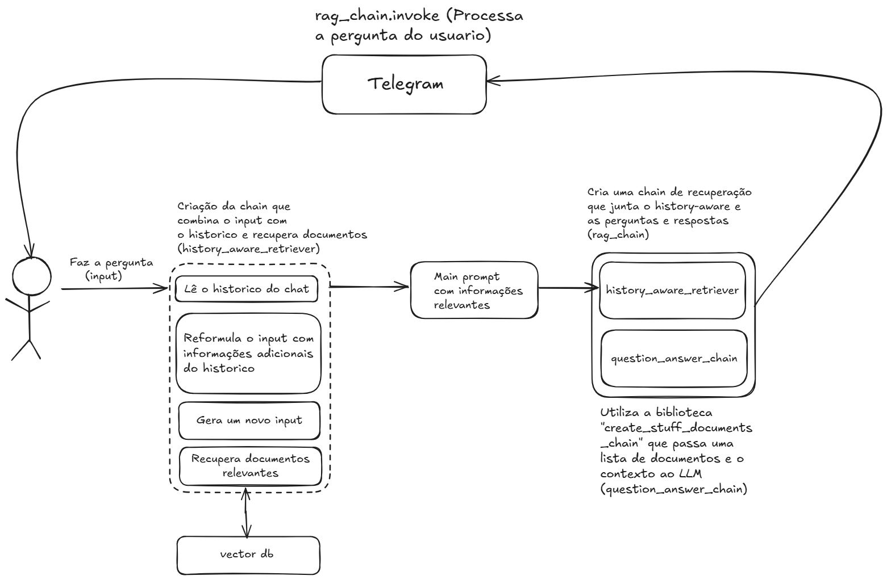

# Chat Bot Furia

Autor:

- Henrique Yuji Zoppello Kanashiro (<henrique.zoppello@gmail.com>)

## **Aviso**

A leitura desta documentação e o entendimento da arquitetura deste projeto serão mais fáceis e melhor aproveitadas se você estiver familiarizado com as seguintes ferramentas: [LangChain](https://python.langchain.com/docs/introduction/) e [Google AI](https://python.langchain.com/docs/integrations/llms/google_ai/).

## 1. Contexto

Projeto desenvolvido para a etapa do desafio tecnico(Chat Bot)

O projeto consiste em um bot assistente que conversará com o usuário e ajudará a fornecer informações sobre a Furia.

O projeto adota como premissa a utilização de informações e noticias, conseguidas através de sites ou fornecidas pela própria Furia.

### 1.1 Objetivo

Desenvolver um chatbot para os fãs do time de CS da FURIA, que possua um caso de uso conversacional relacionado ao time (Telegram, web chat ou mobile chat). O Chatbot deve conter tudo que um fã gostaria de ver para acompanhar e interagir com o time.

## 2. Arquitetura

A arquitetura proposta para o Bot foi desenvolvida utilizando duas ferramentas de código aberto **LangChain** e **ChromaDB**. Para fazer a integração com o Telegram foi utilizada a biblioteca `python-telegram-bot`. Levando em conta o tempo disponível para desenvolver o chatbot, ele foi criado pensando em rodar tanto o bot quanto o banco de dados localmente.

Abaixo, a visão geral da arquitetura:

||
|:-:|
||

A arquitetura final da solução pode ser descrita da seguinte forma:
1. A partir de um input do usuario é iniciado uma chain que reformula o input, unindo essa informação junto com o histórico do chat e documentos relevantes para a resposta;
2. Então outra chain é iniciada para passar todo o contexto da chain anterior, junto com o prompt principal;
3. Por fim a `rag_chain` junta essas duas para gerar a resposta final que será enviada ao usuário.

### 2.1 Etapas do Processo

1. Coleta das informações:
As informações são coletadas manualmente em cada site e armazenadas em arquivos **Markdown**, que serão vetorizados futuramente. Esses arquivos são salvos na pasta `src/embedding/info/*.md`.

2. Embedding das informações:
As informações são vetorizadas utilizando o modelo do **Gemini** `models/embedding-001`. Esses documentos vetorizados são então armazenados dentro do bando de dados **ChromaDB**, localizado na pasta `src/db`.

3. Alimentação do modelo com os documentos (RAG):
A chain `history_aware_retriever` é responsável por coletar a pergunta do usuário, unir ela com o histórico do chat e com documentos que tenham informações úteis para responder essa pergunta, e então reformula a pergunta se necessário para que ela seja compreendida mais facilmente.

4. Prepara a resposta para o usuário:
A chain `question_answer_chain` é responsável por preparar a resposta para o usuário, unindo as informações da chain anterior junto com o prompt principal (`src/prompts/main.txt`) que contém as instruções de como responder a pergunta do usuário.

5. Ativação do fluxo completo
Por fim, a chain `rag_chain` é então invocada para executar todo o fluxo listado acima, e responder o usuário pelo **Telegram**.

## 3. Serviços Utilizados
### 3.1 Google Gemini
O **Google Gemini** foi escolhido para ser a LLM principal do projeto, por ser uma AI eficiente e sem custos para uso, devido aos créditos oferecidos pelo Google. Ele é utilizado como o modelo que vai tanto para responder a pergunta do usuário, quando realizar o embedding dos documentos que serão utilizados para enriquecer a resposta.

A versão do Gemini escolhida para responder o usuário foi a `gemini-2.0-flash`, e a versão escolhida para fazer o embedding dos documentos foi a `models/embedding-001`.

### 3.2 LangChain
LangChain é um framework que facilita a criação de aplicativos com inteligência artificial, como chatbots e assistentes virtuais. Ele possibilita a conexão desses agentes virtuais com bancos de dados, APIs e outros sistemas para que possam buscar informações e realizar tarefas de forma automática.

Nesse projeto foram usadas todas essas bibliotecas e funções:
- `langchain.chains` -> create_history_aware_retriever, create_retrieval_chain
- `langchain.chains.combine_documents` -> create_stuff_documents_chain
- `langchain_community.vectorstores` -> Chroma
- `langchain_core.messages` -> HumanMessage, AIMessage
- `langchain_core.prompts` -> ChatPromptTemplate, MessagesPlaceholder
- `langchain_google_genai` -> ChatGoogleGenerativeAI, GoogleGenerativeAIEmbeddings

### 3.3 ChromaDB
ChromaDB é um banco de dados especializado em armazenar e buscar vetores, que são representações numéricas de textos, imagens e outros dados. Ele é usado principalmente em aplicações de inteligência artificial para encontrar informações parecidas ou relevantes rapidamente, como em buscas semânticas e sistemas de recomendação.

Nesse projeto ele foi utilizado para armazenar os documentos vetorizados, que serviram de base para responder o usuário.

### 3.4 Telegram
Telegram é um aplicativo de mensagens que permite trocar textos, fotos, vídeos e arquivos, além de criar grupos e canais para comunicação em larga escala. Ele se destaca pela rapidez, segurança e recursos avançados como bots e chats secretos.

Nesse projeto ele foi utilizado para integrar o chatbot em um canal de comunicação com o usuário. Sendo as bibliotecas utilizadas:
- `telegram` -> Update
- `telegram.ext` -> ApplicationBuilder, ContextTypes, MessageHandler, filters

## 4. Código do Projeto

O código-fonte deste projeto foi pensado de modo a agilizar a produção mas tentando manter a qualidade. Ele esta separado por processos:
* Criação do Banco de dados
* Divisão das chunks
* Embedding das informações
* Retrieve das informações
* Resposta para o usuário

Juntos, esses processos fazem o fluxo conversacional do bot que é utilizado para responder corretamente a pergunta de um usuário, levando em conta o contexto da Furia que está dentro dos documentos.

### 4.1 Criação do banco de dados
Nesta etapa foi utilizado o **ChromaDB** para ser o banco de dados, o arquivo onde ele é criado é o `src/embedding/docs.py` e ele é populado a partir dos seguintes trechos de código:

#### 4.1.1 Declaração do modelo
O embedding das informações é feito utilizando o Gemini (`models/embedding-001`) e passado para o banco de dados.

```python
embeddings = GoogleGenerativeAIEmbeddings(
        model="models/embedding-001"
    )
```

#### 4.1.2  Divisão das chunks
Aqui fazemos as chunks que futuramente sofrerão o embedding para serem postas nos bancos de dados

Exemplo de uso:

```python
text_splitter = CharacterTextSplitter(chunk_size=3000, chunk_overlap=0)
    docs = text_splitter.split_documents(documents)
```

#### 4.1.3 Vetorização dos documentos
Exemplo de uso:

```python

db_dir = os.path.join(current_dir, "db")
persistent_directory = os.path.join(db_dir, "chroma_db")

print("\n--- Criando e persistindo o vector store ---")
    db = Chroma.from_documents(
        docs, embeddings, persist_directory=persistent_directory)
    print("\n--- Vector store Criado e persistido ---")
```

### 4.2 Fluxo do chatbot
#### 4.2.1 Retrieve dos documentos
Aqui declaramos o retriever que consulta o vector store e retorna as informações com criterios de Similaridade.

```python
retriever = db.as_retriever(
    search_type="similarity",
    search_kwargs={"k": 3},
)
```
#### 4.2.2 Reformulação da pergunta do usuario
A contextualização e recuperação de documentos importantes ocorre nesta parte do processo, isso é feito através do history_aware_retriever,
que junta o llm, o retriever e o promprt de contextualização para reformular a pergunta.

```python
history_aware_retriever = create_history_aware_retriever(
    llm, retriever, contextualize_q_prompt
)
```
#### 4.2.3 Alimentação e Preparação da resposta do usuário
Nessa etapa é utilizado a função `create_stuff_documents_chain` que vai alimentar o llm com os documentos e com o prompt principal, e depois
é criado a rag_chain que juntará a as duas chains para prepar a resposta.

```python
question_answer_chain = create_stuff_documents_chain(llm, qa_prompt)

rag_chain = create_retrieval_chain(history_aware_retriever, question_answer_chain)
```

#### 4.2.4 Integração com o Telegram
A função `handle_message` é assíncrona e trata todas as mensagens de texto que o bot recebe do telegram, é chamada automaticamente pelo 
sistema de eventos do `python-telegram-bot`.

```python
async def handle_message(update: Update, context: ContextTypes.DEFAULT_TYPE):
    user_id = update.effective_user.id
    query = update.message.text
```
update -> contém informações da mensagem recebida

#### Invocação da rag_chain:

```python
result = rag_chain.invoke({"input": query, "chat_history": history})
```

#### Envio da resposta:

```python
await update.message.reply_text(result["answer"])
```

#### Atualização do histórico:

```python
history.append(HumanMessage(content=query))
history.append(AIMessage(content=result["answer"]))
```
#### Função principal:
Garante que este bloco so inicie quando o arquivo for executado diretamente

```python
if __name__ == "__main__":
```